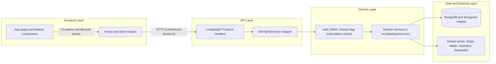
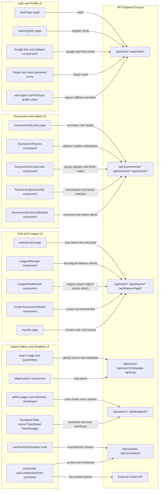
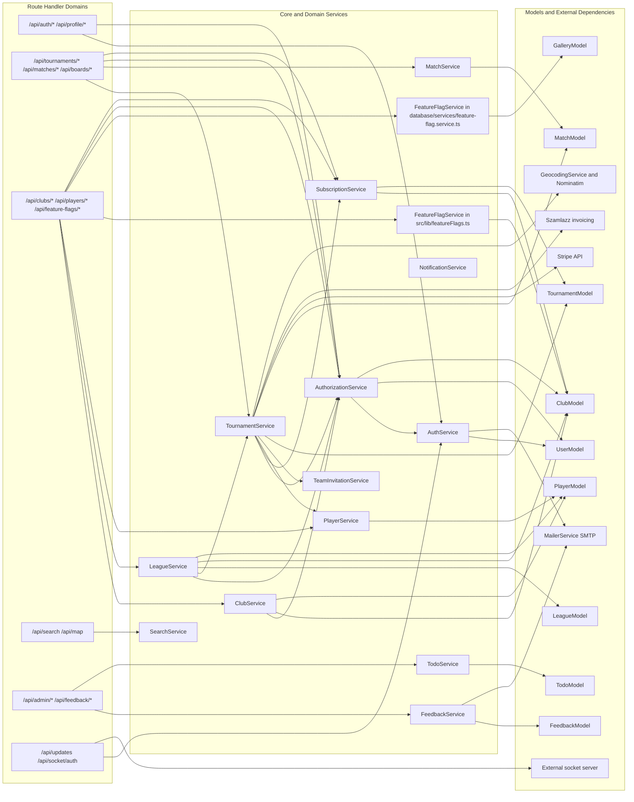

# Service Connection Flowchart

This document maps the current system architecture from UI components to API endpoints, from route handlers to service orchestration, and from services to models and external systems. It is intentionally detailed to support performance optimization and future refactoring decisions.

## SystemWideFlow

## UiToApiRelations

## ApiToServiceRelations

## CrossCuttingGuards

```mermaid
flowchart LR
  requestIn["Incoming request"]
  routeEntry["Route handler in src/app/api"]
  telemetry["withApiTelemetry"]
  tokenExtract["Extract token from header or cookie"]
  tokenVerify["AuthService.verifyToken"]
  userResolve["Resolve user and identity"]
  roleCheck["AuthorizationService role check"]
  flagCheck["FeatureFlagService checks"]
  subscriptionCheck["SubscriptionService limits and plan checks"]
  domainExecute["Domain service execution"]
  modelOps["Model queries and writes"]
  externalCalls["External integrations"]
  responseOut["Response with data or domain error"]

  requestIn --> routeEntry
  routeEntry --> telemetry
  telemetry --> tokenExtract
  tokenExtract --> tokenVerify
  tokenVerify --> userResolve
  userResolve --> roleCheck
  roleCheck --> flagCheck
  flagCheck --> subscriptionCheck
  subscriptionCheck --> domainExecute
  domainExecute --> modelOps
  domainExecute --> externalCalls
  modelOps --> responseOut
  externalCalls --> responseOut
```

## Endpoint and Concern Mapping

- `Auth and profile`: `/api/auth/*`, `/api/profile/*` use `AuthService` for login token verification and email flows, with route-level identity extraction from `AuthorizationService`.
- `Tournament lifecycle`: `/api/tournaments/*`, `/api/matches/*`, `/api/boards/*` route into `TournamentService` and `MatchService`, with repeated authorization and subscription checks.
- `Club and league management`: `/api/clubs/*` and league subroutes combine `FeatureFlagService` checks, role checks, and `LeagueService` plus `ClubService` orchestration.
- `Feature and plan controls`: feature availability combines env flags and club subscription state through `src/lib/featureFlags.ts`, while usage limits are enforced in `SubscriptionService`.
- `Realtime`: UI uses `/api/updates` for SSE and `/api/socket/auth` for socket JWT handoff before calling external socket APIs.
- `Telemetry`: many routes are wrapped by `withApiTelemetry`, making request and failure tracking cross-cutting rather than domain-specific.

## Refactor Readiness Notes

- Current state is route-centric under `src/app/api/**/route.ts`, while project rules target server-action-first architecture; this flowchart captures the existing route-based dependency graph as a migration baseline.
- Authorization and feature gating are partly duplicated across route handlers and services; refactor direction should centralize these checks in thin action controllers with shared guard utilities.
- Domain logic is mostly in `src/database/services/**`, but some route files still perform direct model checks; this should be reduced to preserve a clean boundary for feature slices.
- Two `FeatureFlagService` implementations exist (`src/lib/featureFlags.ts` and `src/database/services/feature-flag.service.ts`); converging these responsibilities is a high-value refactor candidate.
- The chart highlights integration hotspots (subscription limits, RBAC, realtime bridge, external billing) that should be covered by unit and end-to-end tests during migration.
