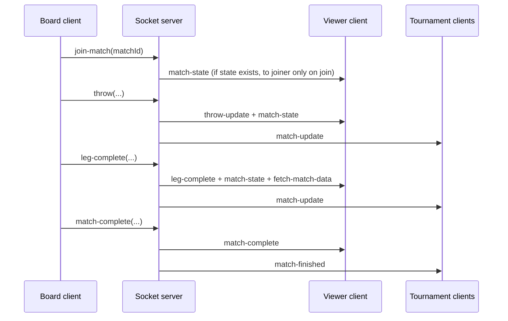

# tDarts Socket Server — Architecture & Event Reference

This document describes **how the `tdarts-socket` service works** so agents can debug integration issues, trace data flow, and spot optimization opportunities. It is derived from `server.js` in this repository.

## Role in the system

- **Process**: `node server.js` (default port **8080**, `SOCKET_PORT`).
- **Stack**: Node.js `http` + **Express** (REST) + **Socket.IO v4** (`allowEIO3: true`).
- **Next.js** runs separately (`next-server.js`, port **3000**); it does not host Socket.IO in this repo.
- **Persistence**: Match state lives in an **in-memory `Map`** (`matchStates`). This service does **not** write to MongoDB. Long-term storage and `winnerArrowCount` on persisted legs belong to the main tDarts app/API; the socket layer only mirrors live state for viewers and must stay consistent with what the board client emits.

---

## Environment & security

| Variable | Purpose |
|----------|---------|
| `SOCKET_JWT_SECRET` | **Required.** Verifies JWT for Socket.IO handshake and REST `Authorization: Bearer`. |
| `ALLOWED_ORIGIN` | **CORS + origin gate.** Socket.IO `cors.origin` and handshake `Origin` check use **strict equality** to this value (default `https://tdarts.sironic.hu`). |
| `SOCKET_PORT` | HTTP/Socket.IO listen port (default `8080`). |
| `ENABLE_MONITORING` | If `true`, enables `monitor-server.js` (metrics file + `/api/metrics`). |

**Socket authentication**: Client must pass `auth: { token: "<JWT>" }` on connect. Middleware sets `socket.userId` and `socket.userRole` from JWT payload.

**REST authentication**: `GET/POST /api/socket` and `GET /api/metrics` require `Origin: ALLOWED_ORIGIN` and `Authorization: Bearer <JWT>`.

**Operational note**: Comments mention localhost for development, but the code only allows the configured `ALLOWED_ORIGIN`. Local dev must set `ALLOWED_ORIGIN` to match the app origin (e.g. `http://localhost:3000`) or connections fail.

---

## Rooms (Socket.IO)

Clients join named rooms for scoped broadcasts:

| Room name | Typical use |
|-----------|-------------|
| `tournament-${tournamentCode}` | Tournament-wide listeners (live lists, match started/finished). |
| `match-${matchId}` | All clients following one match (state sync, throws, leg complete). |

**Join/leave events** (client → server):

- `join-tournament` → `(tournamentCode)` → `socket.join("tournament-${code}")`
- `join-match` → `(matchId)` → `socket.join("match-${matchId}")` — if state exists, server emits **`match-state`** once to **that socket only**.
- `leave-match` → `(matchId)` → `socket.leave(...)`

---

## In-memory `matchState` shape

`matchStates` is keyed by `matchId` (string). When missing, `ensureState()` creates a default 501 / best-of style skeleton.

Typical structure:

```text
{
  currentLeg: number,
  player1LegsWon: number,
  player2LegsWon: number,
  completedLegs: Array<{
    legNumber,
    winnerId,
    player1Throws, player2Throws,   // from leg-complete payload when provided
    player1Stats, player2Stats,
    winnerArrowCount: number | null, // copied from currentLegData at leg-complete
    completedAt: number
  }>,
  startingScore: number,           // default 501
  legsToWin: number,               // default 3
  initialStartingPlayer: 1 | 2,
  player1Name?, player2Name?,      // from set-match-players
  currentLegData: {
    player1Id, player2Id,
    player1Score, player2Score,
    player1Throws, player2Throws,  // array of normalized throw objects
    player1Remaining, player2Remaining,
    currentPlayer: 1 | 2,
    winnerArrowCount?: number | null // set on checkout throw; cleared on next leg
  }
}
```

**Per-throw object** stored in `player1Throws` / `player2Throws` (from `updateMatchStateOnThrow`):

```text
{
  score, darts?, isDouble?, isCheckout?, remainingScore,
  timestamp, playerId,
  arrowCount?   // only when checkout and client sent arrowCount
}
```

---

## Client → server events

### `init-match`

Payload: `{ matchId, startingScore?, legsToWin?, startingPlayer? }`

- Merges into existing state or creates new.
- Updates `startingScore`, `legsToWin`, `initialStartingPlayer`; if new, sets `currentLegData.currentPlayer`.
- Broadcasts **`match-state`** to **other** sockets in `match-${matchId}` (`socket.to`, **emitter excluded**).

### `set-match-players`

Payload: `{ matchId, player1Id, player2Id, player1Name?, player2Name? }`

- Ensures/creates state, assigns IDs and optional display names.
- Broadcasts **`match-state`** to room (excluding sender).

### `throw`

Payload (as used by the board; optional fields depend on client):

```text
{
  matchId,
  playerId,
  score,
  remainingScore,
  isCheckout?: boolean,
  legNumber?,              // forwarded in logs / clients; server state uses its own currentLeg
  tournamentCode?: string, // for tournament room; falls back to "unknown" if missing
  darts?, isDouble?,
  arrowCount?: number      // 1–3 on checkout; see below
}
```

**Server behavior** (`updateMatchStateOnThrow`):

1. Normalizes a throw object; if `isCheckout && arrowCount`, attaches `arrowCount` to the stored throw and sets `currentLegData.winnerArrowCount = arrowCount`.
2. Compares `data.playerId` to `currentLegData.player1Id` to decide which side threw; appends to `player1Throws` or `player2Throws`, updates `playerRemaining`, toggles `currentPlayer` (1→2 or 2→1).

**Broadcasts** (all exclude the emitting socket):

- `throw-update` with **raw client `data`**
- `match-state` with **full updated state**
- `match-update` to `tournament-${tournamentCode}` with `{ matchId, state }`

If `ENABLE_MONITORING`, counts messages sent/received.

### `undo-throw`

Payload: `{ matchId, playerId, tournamentCode? }`

- Pops last throw for that player’s array, restores remaining score (capped at `startingScore`), sets `currentPlayer` back to that player.
- Broadcasts **`match-state`** + **`match-update`** (tournament room).

### `leg-complete`

Payload: `{ matchId, tournamentCode?, winnerId, legNumber, completedLeg?: { player1Throws, player2Throws, player1Stats, player2Stats } }`

**Server behavior** (`completeLeg`):

- Increments `player1LegsWon` or `player2LegsWon` from `winnerId`.
- Pushes a **completed leg** entry with `winnerArrowCount: currentLegData.winnerArrowCount || null` (so checkout must have run with `arrowCount` on the winning **`throw`** first).
- Advances `currentLeg`, resets `currentLegData` to new leg (same player IDs, alternating starter via `initialStartingPlayer` and parity of `currentLeg - 1`).

**Broadcasts** (exclude sender):

- `leg-complete` (echoes client `data`)
- `match-state`
- `fetch-match-data` with `{ matchId }` — signal for clients to refetch canonical match from API
- `match-update` (tournament room)

### `match-complete`

Payload: `{ matchId, tournamentCode? }`

- **Deletes** `matchStates` entry for `matchId`.
- Broadcasts `match-complete` to match room and `match-finished` to tournament room.

### `match-started`

Payload: `{ matchId, tournamentCode?, matchData? }`

- Broadcasts `match-started` to tournament room only (no match room requirement).

---

## Server → client events (summary)

| Event | Who receives | Purpose |
|--------|----------------|---------|
| `match-state` | Joining client on `join-match`, or room on state-changing handlers (excluding emitter) | Full snapshot for UI sync |
| `throw-update` | `match-${matchId}` (excluding emitter) | Lightweight echo of last throw payload |
| `match-update` | `tournament-${code}` | Tournament dashboard / list |
| `leg-complete` | Match room | Leg finished notification + same payload client sent |
| `fetch-match-data` | Match room | Trigger API reload |
| `match-complete` | Match room | Match ended |
| `match-finished` | Tournament room | Match removed from live set server-side |
| `match-started` | Tournament room | New live match |

---

## Critical integration detail: `socket.to()` excludes the sender

Almost all broadcasts use `socket.to(\`match-${id}\`)` / `socket.to(\`tournament-${code}\`)`, **not** `io.to(...)`.

Implications for debugging:

- The **client that emits** `throw`, `leg-complete`, etc. does **not** receive those broadcasts from this server for that action; the board app typically keeps authoritative UI from local actions and relies on socket for **other** tabs/viewers.
- If a feature “works on board but not on viewer”, trace **receiver** subscriptions (`join-match`, `join-tournament`) and payloads, not the emitter’s listeners.

---

## Checkout & `arrowCount` / `winnerArrowCount` flow

Intended sequence:

1. Board emits **`throw`** with `isCheckout: true`, `remainingScore: 0`, and **`arrowCount`** in `{1,2,3}`.
2. Server sets `currentLegData.winnerArrowCount` and stores `arrowCount` on the last throw object in memory.
3. Board (or orchestration) emits **`leg-complete`** with winner and optional `completedLeg` throw arrays.
4. Server copies `winnerArrowCount` into `completedLegs[]` and clears `currentLegData.winnerArrowCount` for the next leg.

**Failure modes for agents:**

- **`leg-complete` without prior checkout `throw` with `arrowCount`**: `winnerArrowCount` may be `null` in `completedLegs` even if the DB schema supports it elsewhere.
- **`playerId` mismatch**: Throws are attributed by strict equality with `player1Id`/`player2Id`; wrong type (string vs object id) routes throws to the wrong side or breaks toggling.
- **Missing `tournamentCode`**: Updates still go to the match room, but tournament room gets `tournament-unknown`.

---

## REST API (same process as Socket.IO)

- **`GET /api/socket`** — health-style JSON (auth required).
- **`POST /api/socket`** — body `{ action, matchId? }`:
  - `get-match-state` → returns `{ state }` from memory or `null`.
  - `get-live-matches` → lists derived fields from all in-memory states (names, legs won, remaining, etc.).
- **`GET /api/metrics`** — when monitoring enabled, returns parsed `server-metrics.json`.

Useful for debugging “what does the server think right now?” without a browser.

---

## Monitoring & load testing

- **`ENABLE_MONITORING=true`**: periodic metrics + connection/message counters (`monitor-server.js`).
- **`stress-test.js`**: JWT + `SOCKET_URL`; simulates many matches and viewers; see `STRESS_TEST.md` / `QUICK_START_STRESS_TEST.md`.

---

## Optimization & reliability notes (for agents)

1. **Double fan-out on every throw**: `throw-update` + full `match-state` + `match-update` — redundant for some clients; possible to consolidate or throttle if bandwidth/CPU matters.
2. **Full state broadcast**: Large `completedLegs` + all throws grow payloads; consider diff/patch events if scales increase.
3. **Single process memory**: No Redis; restarting the process **drops** all `matchStates`. Horizontal scaling would require a shared store and sticky sessions or adapter.
4. **`global.matchStates`**: Exposed for ad-hoc inspection; not a public API contract.
5. **CORS / origin**: Strict single origin — misconfiguration is a frequent “connects from wrong URL” bug.

---

## File map

| File | Responsibility |
|------|----------------|
| `server.js` | Socket.IO, Express, `matchStates`, throw/leg/match logic |
| `monitor-server.js` | Optional metrics |
| `stress-test.js` | Load generator |
| `next-server.js` | Next.js only |

---

## Quick event flow (mermaid)



---

*Last aligned with `server.js` in this repository. If the main tDarts app changes event payloads or adds DB sync, update this doc and the board client contract together.*
