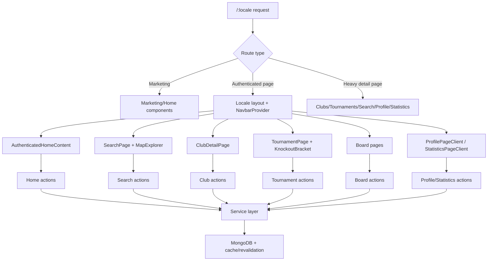

# Frontend-Service Architecture

This document maps the current frontend architecture (layouts/pages/components) to server actions and service-layer dependencies. It is intended as a practical reference for reliability and performance optimization work.

## 1) System Context and Route Contract

- `/:locale` - locale root resolver route for anonymous entry; auth-cookie redirect to `/:locale/home` is handled in `src/proxy.ts`.
- `/:locale/home` - authenticated landing/dashboard experience.
- `/:locale/landing` - always-public marketing route (accessible even for logged-in users).
- Guarded routes (`home`, `profile`, `statistics`, `myclub`, admin) use server auth checks and redirect to localized login when user is missing.

### Auth and Redirect Entry Points

- `src/proxy.ts` - locale root auth-cookie redirect gate.
- `src/lib/getServerUser.ts` - shared server user resolver.
- `src/app/[locale]/auth/layout.tsx` - redirects authenticated users away from auth pages.
- `src/app/[locale]/admin/layout.tsx` - server guard for admin pages.
- Guarded pages:
  - `src/app/[locale]/home/page.tsx`
  - `src/app/[locale]/profile/page.tsx`
  - `src/app/[locale]/statistics/page.tsx`
  - `src/app/[locale]/myclub/page.tsx`

## 2) Layout and Shell Architecture

- `src/app/[locale]/layout.tsx`
  - Global shell: locale messages, metadata, providers (`SessionProvider`, `UserProvider`, `NavbarProvider`, `AuthSync`).
- `src/components/providers/NavbarProvider.tsx`
  - App chrome orchestration: `DesktopSidebar`, `MobileBottomNav`, transitions, route-aware navbar visibility.
- `src/app/[locale]/auth/layout.tsx`
  - Auth-only wrapper with authenticated-user redirect.
- `src/app/[locale]/admin/layout.tsx`
  - Admin server-side authorization wrapper.
- `src/app/[locale]/clubs/[code]/layout.tsx`
  - Club-scoped SEO metadata and theme variables.
- `src/app/[locale]/tournaments/[code]/layout.tsx`
  - Tournament metadata layout.
- `src/app/[locale]/tournaments/[code]/live/layout.tsx`
  - Live feature gate and fallback rendering.

## 3) Frontend -> Action -> Service Connections

## Home Domain

- `src/components/home/AuthenticatedHomeContent.tsx`
  - `getUserTournamentsAction` -> `src/features/tournaments/actions/getUserTournaments.action.ts` -> `TournamentModel` queries + player/match merges.
  - `getPlayerStatsAction` -> `src/features/profile/actions/getPlayerStats.action.ts` -> `src/features/profile/lib/profilePlayerStats.ts`.
  - `getLeagueHistoryAction` -> `src/features/profile/actions/getLeagueHistory.action.ts` -> `src/features/profile/lib/profileLeagueHistory.ts`.
  - `checkFeatureFlagAction` -> `src/features/feature-flags/actions/checkFeatureFlags.action.ts` -> feature flag service checks.
  - `getActiveAnnouncementsAction` -> `src/features/announcements/actions/getActiveAnnouncements.action.ts` -> `AnnouncementService`.

## Search Domain

- `src/app/[locale]/search/page.tsx`
  - `searchAction` -> `src/features/search/actions/search.action.ts` -> `src/database/services/search.service.ts` (`searchGlobal`, per-tab searches, counts, metadata).
  - `mapSearchAction` -> `src/features/search/actions/mapSearch.action.ts` -> map query path in search service.
- `src/components/map/MapExplorer.tsx`
  - Also invokes `mapSearchAction` (potential duplicate map data fetch path with page-level map tab fetch).

## Club Domain

- `src/app/[locale]/clubs/[code]/page.tsx`
  - `getClubAction` -> `src/features/clubs/actions/getClub.action.ts` -> `ClubService.getClub`.
  - `getUserRoleAction` -> `src/features/clubs/actions/getUserRole.action.ts` -> `ClubService.getUserRoleInClub`.
  - `getClubPostsAction` -> `src/features/clubs/actions/getClubPosts.action.ts` -> `PostService.getClubPosts`.
  - Mutations (`addMember`, `removeMember`, `deactivateClub`) -> `ClubService`.
  - OAC/tournament support actions:
    - `checkOacLeagueAction`
    - `getTournamentDeletionInfoAction`, `deleteTournamentAction` -> `TournamentService` deletion flow.
- `src/components/club/CreateTournamentModal.tsx`
  - `createTournamentAction` + club/league fetch actions.

## Tournament + Knockout Domain

- `src/app/[locale]/tournaments/[code]/page.tsx`
  - Uses `useTournamentPageData` hook:
    - `getTournamentPageDataAction` -> `src/features/tournaments/actions/getTournamentPageData.action.ts` -> `TournamentService.getTournamentSummaryForPublicPage`.
  - `reopenTournamentAction` for admin tournament state rollback/reopen.
- `src/components/tournament/TournamentStatusChanger.tsx`
  - Uses `manageTournament.action.ts` (groups, knockout generation/cancel, finish).
- `src/components/tournament/TournamentKnockoutBracket.tsx`
  - Uses `knockoutManagement.action.ts` -> `TournamentService.getKnockoutViewDataLite` + knockout mutations.

## Board Domain

- `src/app/[locale]/board/page.tsx`
  - `validateTournamentAction` -> password-based tournament entry validation.
- `src/app/[locale]/board/[tournamentId]/page.tsx`
  - `src/features/board/actions/boardPage.action.ts`:
    - validate board password
    - fetch board/tournament/matches
    - start and finish board matches
  - Service dependencies: `TournamentService`, `MatchService`, `ClubService`.

## Profile + Statistics Domain

- `src/components/profile/ProfilePageClient.tsx`
  - `getPlayerStatsAction`, `getLeagueHistoryAction`, `getTicketsAction`.
  - update and verification actions (`updateProfile`, `verifyEmail`, `resendVerification`).
- `src/app/[locale]/statistics/page.tsx` -> `StatisticsPageClient`
  - `getPlayerStatisticsAction` -> statistics action/service path over finished-match history.

## MyClub Domain

- `src/app/[locale]/myclub/MyClubClient.tsx`
  - `getUserClubsAction` -> `ClubService.getUserClubs`.
- If no club, `ClubRegistrationForm` uses `createClubAction`.

## 4) High-Risk Bottlenecks and Bad Flows

1. Heavy tournament page payload and deep populate graph
   - `src/features/tournaments/actions/getTournamentPageData.action.ts`
   - `src/database/services/tournament.service.ts` (`getTournamentSummaryForPublicPage`)
   - Risk: overfetch + large hydration payload + higher tail latency under concurrency.

2. Search fanout and duplicate map fetching
   - `src/features/search/actions/search.action.ts`
   - `src/database/services/search.service.ts`
   - `src/app/[locale]/search/page.tsx` and `src/components/map/MapExplorer.tsx`
   - Risk: global tab runs multiple query paths + counts/metadata; map may be fetched twice.

3. Club detail path still multi-step and mutation-refresh heavy
   - `src/app/[locale]/clubs/[code]/page.tsx`
   - `src/database/services/club.service.ts`
   - Risk: repeated full club refetch after mutations + large payload.

4. Write-on-read / side effects in read paths (historical risk pattern)
   - Service functions that create/update entities during read flows can amplify contention under load.
   - Should remain disabled in hot read paths.

5. Profile/statistics aggregation pressure
   - `src/features/profile/lib/profilePlayerStats.ts`
   - statistics action path in `src/features/statistics/actions/getPlayerStatistics.action.ts`
   - Risk: expensive match-history reads and aggregation fanout.

6. Realtime refresh pressure
   - Tournament/board polling or refresh hooks can trigger repeated full payload reloads.
   - Scope should stay partial and event-targeted where possible.

## 5) Prioritized Improvement Opportunities

1. Enforce SSR-first shells for heavy pages with progressive client sections
   - Targets: `home`, `clubs`, `tournaments`, `profile/statistics`.
   - Pass initial server payload to client to avoid hydration double-fetch.

2. Further split tournament payloads by tab
   - Keep overview/player/board/knockout fetches isolated instead of one broad summary payload.

3. Add strict request dedupe and cancellation strategy across search and map
   - Keep version guards on page fetches.
   - Ensure map data is loaded through one canonical source per state transition.

4. Reduce post-mutation full refreshes
   - Update local state optimistically or patch only affected slices; avoid route-wide `router.refresh()` in hot flows.

5. Strengthen cache policy by data volatility
   - Stable metadata/theme/config data: longer cache windows.
   - Dynamic match/board state: short cache or targeted invalidation.

6. Track endpoint-level p95/p99 and timeout-rate gates for each release
   - Continue 150-concurrency browse + lifecycle validation after build/restart.

## 6) Architecture Flow (Mermaid)

