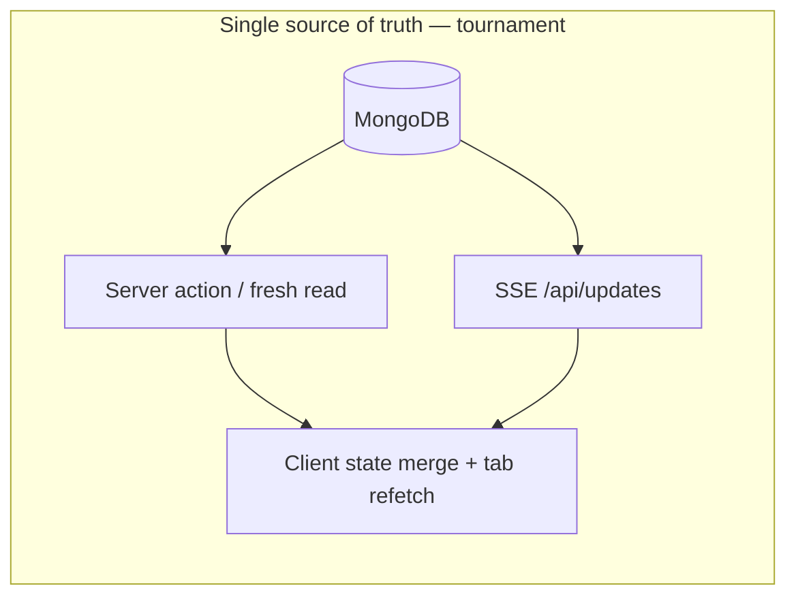

# Performance and subscription-like SSE — implementation plan (v3)

**Status:** Living document — tracks agreed product constraints, audit findings, and implementation order.  
**Related docs:** [Frontend-service architecture](./frontend-service-architecture.md), [Data access index canary checklist](./data-access-index-canary-checklist.md), [Index rollout canary](./index-rollout-canary.md), [Timeout baseline profiler](./timeout-baseline-profiler.md), [Data access baseline / self-audit](../refactor-ideas/data-access-baseline-and-self-audit.md).

## Overview

Adopt **subscription-like SSE**: after each successful DB mutation, emit typed `SseDeltaPayload` patches; clients merge into state; navigation, reconnect, and refresh re-read Mongo as the sole authority. **Not** Mongo Change Streams for v1; use **app-level publish** via `eventsBus`. Harden connection parity (main vs TV), revision/gap policy, and multi-instance path (Redis) when needed. Other tracks: search fan-out, club refetch shaping, index canary ops, production-spike-driven tests.

## Implementation checklist

- [ ] **sse-subscription-deltas** — Monotonic `tournamentRevision` + gap→refetch; enrich publishers on all hot mutation paths; widen `applySseDelta` / TV apply; strip `requiresResync` where payload is authoritative; audit `GROUP_UPDATE` normalization in `api/updates`.
- [ ] **sse-tournament-reliability** — Shared `LIVE_TOURNAMENT_STATUSES` + `useRealTimeUpdates` options between TV and tournament page; resync storm caps; `NEXT_PUBLIC_SSE_DEBUG` metrics.
- [ ] **prod-spike-tests** — Load/regression cases from v3 production spikes (routes, concurrency, SSE dropouts); tests or scripted load profiles.
- [ ] **baseline-staging** — `perf:baseline:timeout` + explain/hint on hot queries; correlate with prod latency dashboards.
- [ ] **search-fanout-v2** — Validate and enable `FF_SEARCH_FANOUT_V2` (or remove legacy `getTabCounts` path) for global tab.
- [ ] **club-partial-refresh** — Replace repeated `fetchClub` summary with mutation-scoped patches or debounced refetch.
- [ ] **profile-stats-measure** — Trace `PlayerStatisticsSection` actions; cache or precomputed aggregates if telemetry shows hotspots.

---

## Product constraints (v3 / production)

- **Tests:** Suite is acceptable; add **tests and load shapes informed by production usage and spike windows**, not only static unit coverage.
- **Tournament page:** **Do not** rely on force-cached SSR (`unstable_cache` / default cached first paint) for tournament detail. Data changes too often; that would introduce **multiple truths** (stale shell vs live board vs SSE). Keep **fresh server reads** and explicit client refetch as the contract.
- **Realtime — chosen architecture (subscription-like SSE):** After writes commit, the server publishes **UI-shaped deltas** (`SseDeltaPayload`) on the existing SSE connection (`src/app/api/updates/route.ts`, `src/lib/events.ts`). Clients **merge** events into local state. **Initial load, reconnect, navigation, and explicit refresh** perform normal **Mongo-backed reads** — no second source of truth. **Mongo Change Streams** are out of scope for v1 unless non-app writers appear later; scaling beyond one Node instance requires **Redis (or similar) pub/sub** in front of SSE fan-out.
- **Gap:** Main tournament page is **less stable** than TV today; TV’s simpler consumer loop is the baseline to align with while implementing delta-first behavior.

---

## What the performance docs claim vs what the code already does

| Doc theme | Code reality (verified) |
| --------- | ------------------------- |
| **Tournament “one giant payload”** | Mitigated by sectioned reads: `getTournamentPageData.action.ts` → `getTournamentReadModelForSection` in `tournament.service.ts`. `useTournamentPageData.ts` merges by tab. |
| **Search fan-out + duplicate map** | Map tab uses `MapExplorer` + `mapSearchAction` (`src/app/[locale]/search/page.tsx`). Global tab may still double-query unless `FF_SEARCH_FANOUT_V2` — `search.action.ts`. |
| **Index coverage** | Schemas declare checklist-style indexes (`player.model.ts`, `match.model.ts`, `league.model.ts`, `club.model.ts`). Ops work is **canary / explain / planner**, not blindly adding definitions. |
| **Timeout baselines** | `scripts/capture-timeout-baseline.mjs` + `perf:baseline:timeout`. |

---

## Issue 1 — Tournament page: non-goals and SSE-first

**Approved target:** **Subscription-like SSE** — same connection model as today, but **fewer full refetches** by making deltas **complete enough** to patch client state, with **revision ordering** for reconnect safety. Full reads remain for cold start and recovery only.

**Dropped:** Defaulting tournament SSR to `unstable_cache` / non-force-fresh reads (conflicts with high churn and single source of truth).

**Keep / refine:**

1. **SSR:** Keep tournament page **always fresh** for initial payload (`bypassCache` + `force-fresh`). Optimize **query shape and payload size** (sectioned reads; avoid `full` except TV / rare tools), not HTTP-level stale cache.
2. **SSE as primary live path:** Implement the subscription model end-to-end; make main tournament behavior as dependable as TV:
   - **TV:** `src/app/[locale]/tournaments/[code]/tv/page.tsx` uses `useRealTimeUpdates` directly; on delta failure applies `applyTvDelta` then debounced `silentRefresh` (~400ms + optional jitter).
   - **Main:** `useTournamentRealtimeRefresh.ts` wraps the same hook with coalescing, lite-then-full escalation, visibility handling, and `applySseDelta` in `useTournamentPageData.ts` — more branches ⇒ more failure modes.
3. **Engineering steps:**
   - Dedupe `LIVE_TOURNAMENT_STATUSES` into one module (today duplicated in TV + hook).
   - Instrument with `NEXT_PUBLIC_SSE_DEBUG=true`.
   - Shared “tournament SSE consumer” config (reconnect backoff, debounce, lite vs full resync) so TV and main differ only in **apply** logic.
   - Cap or coalesce **resync storms**; surface degraded state if needed.

**Success metrics:** SSE connected time % on main tournament page ≈ TV; fewer redundant `getTournamentPageDataAction` calls during live play; user-visible lag within v3 prod percentiles.

---

## Architectural note — “DB subscribe” SSE (adopted)

**Status:** **Adopted** — intended end state for realtime tournament / TV / board surfaces: **app-level publish**, not Mongo Change Streams for v1.

**Model:** Push **small, typed patches**; merge on the client; use **navigation / reconnect / refresh** to reconcile with Mongo.

### Rating (reference)

| Lens | Score | Comment |
| ---- | ----: | ------- |
| Direction for this product | **8/10** | Live = patches; cold start = authoritative read. |
| Fit with current codebase | **6/10** | `SseDeltaPayload`, `eventsBus`, `/api/updates` exist; many paths still `requiresResync` or refetch when merge fails. |
| Mongo Change Streams | **4–5/10** | Noisy; multi-instance still needs Redis/Kafka; app writes already go through services. |
| End-state stability | **7/10 achievable** | With ordering / gap detection and “gap → one targeted refetch,” not silent drift. |

### Reducing full reads (concrete steps)

1. Widen `applySseDelta` in `useTournamentPageData.ts` for `group` / `match` / `tournament` when payload is sufficient (group currently forces resync in `api/updates` normalization).
2. Richer deltas from writers (`matchGameplay.action.ts`, tournament lifecycle): IDs + minimal fields the UI needs.
3. **Versioning:** extend `eventId` or add `tournamentRevision`; client detects missed messages after reconnect → **one** read (section or lite).
4. **TV:** thin initial read + same delta stream between refreshes.

### Risks

- **Derived state** (standings, bracket): emit authoritative fragments or keep narrow `requiresResync` until tests cover merges.
- **Multi-instance:** in-proc `EventEmitter` does not span instances → **Redis pub/sub** (or equivalent) when scaling out.

---

## Issue 2 — Production spike–driven tests

1. From production metrics/logs: spike signatures — routes, concurrency, tournament statuses, `ETIMEDOUT`, SSE disconnects.
2. Encode as load scripts and/or integration tests (SSE burst, reconnect, gap handling); assert refetch caps.
3. Optional release gates: regression budget from prod (p95 latency, reconnect rate).

---

## Issue 3 — Search global tab (`FF_SEARCH_FANOUT_V2`)

Validate in staging, then default on or remove legacy `getTabCounts` for global tab when parity confirmed — `src/features/search/actions/search.action.ts`.

---

## Issue 4 — Club detail refetch churn

Narrow patches vs full `fetchClub()` in `src/app/[locale]/clubs/[code]/ClubDetailClientPage.tsx`.

---

## Issue 5 — Profile / statistics aggregation

Measure first; then short TTL cache or precomputed aggregates only where data is stable.

---

## Issue 6 — Index canary + explain

Follow [data-access-index-canary-checklist](./data-access-index-canary-checklist.md) and [index-rollout-canary](./index-rollout-canary.md); use `perf:baseline:timeout` for before/after.

---

## Issue 7 — OAC MMR lifecycle test (self-audit)

**Deprioritized** if the suite is green; revisit when MMR logic changes.

---

## Suggested implementation order

1. **Subscription-like deltas** — `tournamentRevision` on publish + client gap handling; audit mutation publishers; relax `requiresResync` in `api/updates/route.ts` only where merge + tests exist.
2. **SSE reliability / parity** — shared constants, hook config, resync caps, debug metrics (can ship alongside step 1).
3. **Prod spike → tests / load profiles** — include SSE burst, disconnect, reconnect + gap.
4. **Search fan-out v2.**
5. **Club partial refresh.**
6. **Profile stats** if telemetry warrants.
7. **Index canary / explain** in parallel.
8. **Multi-instance:** Redis (or equivalent) for `eventsBus` fan-out; document in ops runbook.

Correctness of **merge + recover** beats raw latency tricks; **DB stays authoritative** whenever the stream is unsure.
